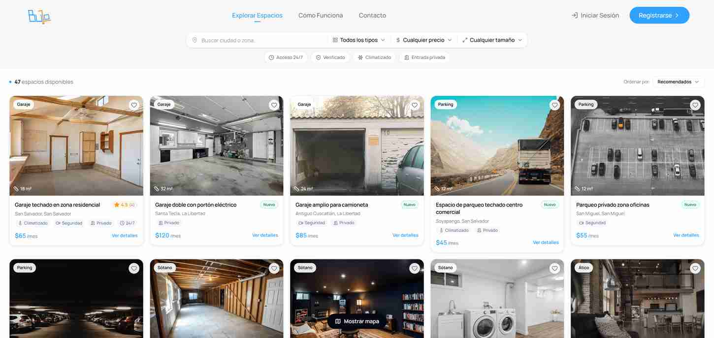
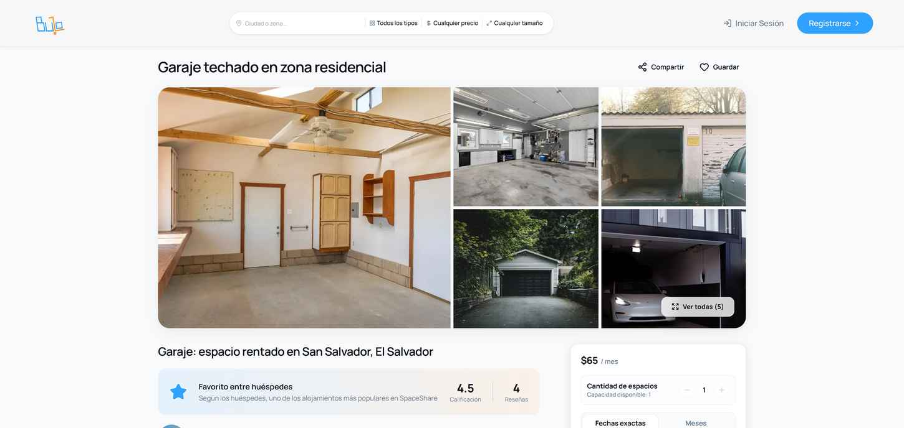
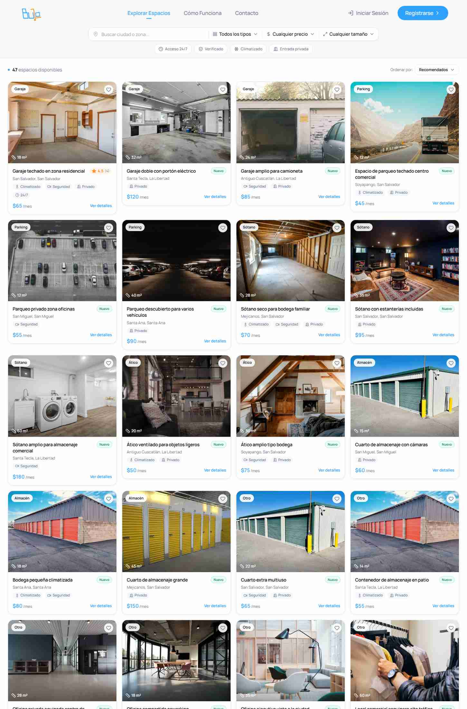
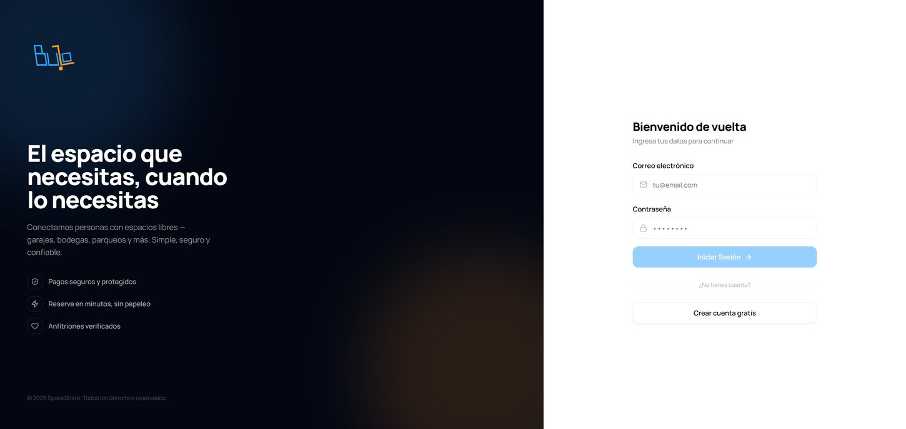
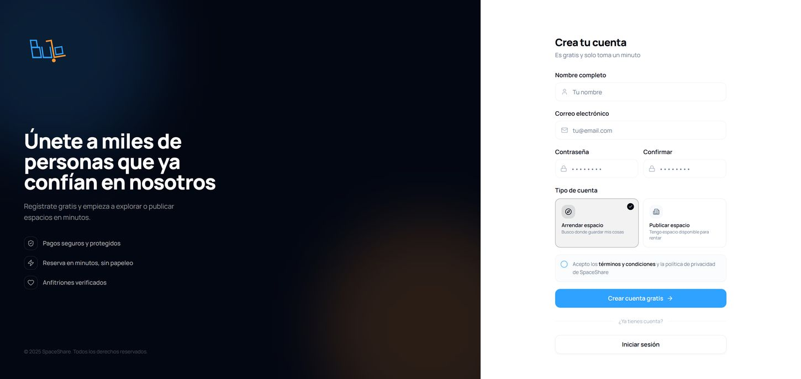

# SpaceShare — Frontend

Marketplace de espacios en renta — garajes, sótanos, bodegas, parqueos y locales — para El Salvador y Panamá. Los dueños publican su espacio con fotos y precio; quien necesita guardar sus cosas o rentar un espacio explora por ciudad, tipo y tamaño, reserva y paga en línea con tarjeta (3D Secure).

Aplicación **Next.js 14 (App Router)**. Este repo es solo el frontend; la API vive en `api-space-share` (privado).



---

## Idea de producto

Un dueño de espacio libre lo publica una vez y deja de perseguir inquilinos por WhatsApp; quien necesita guardar sus cosas encuentra opciones cerca, ve el precio de una vez y reserva sin ir a verlo en persona primero. El pago queda protegido: SpaceShare cobra en línea y solo libera el dinero al anfitrión según las reglas de la reserva.

---

## Stack

| Área | Tecnología |
|---|---|
| Framework | Next.js 14 (App Router), React 18, TypeScript |
| Estado | Zustand |
| Datos remotos | TanStack Query |
| UI | Radix UI (primitivas), Tailwind CSS |
| Mapas | `@react-google-maps/api` |
| Pagos | Wompi (popup + página de resultado, autenticación 3D Secure) |

---

## Arquitectura

### Hexagonal/clean — plantilla reusada entre proyectos

Capas estrictas: `core/domain` (entidades y puertos, sin dependencia de framework), `core/application` (casos de uso), `infrastructure` (implementa los puertos: API, repositorios, servicios), `presentation` (UI y estado), `bootstrap` (composition root). Regla dura: **`presentation` nunca importa `infrastructure` directamente**, siempre pasa por el composition root. Esta misma estructura se tomó como plantilla de otro proyecto propio y se adaptó a las entidades de este dominio (espacio, reserva, usuario, reseña) — reutilización real de arquitectura entre proyectos, no copiar y pegar lógica de negocio.

```
src/
  app/                # rutas (App Router)
    explore/  space/[id]/  favorites/  contact/  how-it-works/
    login/  register/  payment-result/
    dashboard/  admin/  host/  user/  messages/
  core/
    domain/            # entidades, puertos, errores — sin dependencia de framework
    application/       # casos de uso, contratos
  infrastructure/
    api/               # dtos, mappers
    repositories/       # implementación de los puertos (API + copia local)
    http/  services/  utils/
  presentation/
    components/         # ui, shared
    features/           # un folder por sección (explore, auth, dashboard, messages, space-detail, ...)
    hooks/  state/  guards/  layouts/  providers/
  bootstrap/            # composition root
```

### Repositorios híbridos online/offline

Los repositorios deciden en tiempo de ejecución si resuelven contra la API o contra una copia local — mismo patrón conceptual usado a nivel de arquitectura general, no solo en una función puntual.

### Pago con Wompi — dos flujos, uno sin webhook

La pasarela ofrece dos formas de cobro con comportamiento muy distinto: un link de pago que sí notifica por webhook, y el pago directo con tarjeta (3D Secure) que **no envía ninguna notificación** — esto no está documentado en ningún lado, se confirmó depurando en producción. Solución del lado del frontend: guardar el ID de la transacción antes de redirigir a la autenticación 3DS y, al volver, consultar activamente el estado en vez de esperar un aviso que nunca llega.

---

## Correr en local

```bash
pnpm install
cp .env.example .env.local        # ver variables abajo
pnpm dev                           # http://localhost:3000
```

### Variables de entorno

Lista completa en [`.env.example`](.env.example).

| Variable | Uso |
|---|---|
| `NEXT_PUBLIC_API_URL` | Base de la API (`http://localhost:3001/api` en local) |
| `NEXT_PUBLIC_GOOGLE_MAPS_API_KEY` | Mapa de ubicación de cada espacio |

---

## Despliegue

Se empaqueta con el `Dockerfile` incluido y se corre como contenedor detrás de un reverse proxy con TLS. Las variables se inyectan por entorno, nunca se versionan.

---

## Forma de trabajo

Commits en Conventional Commits (`feat:`, `fix:`, `refactor:`). Rama `main`. La regla de capas de arriba (`presentation` nunca importa `infrastructure` directamente) se respeta en todo el código, no es solo una nota de README.

---

## Capturas

| Detalle de espacio | Catálogo |
|---|---|
|  |  |

| Iniciar sesión | Registro |
|---|---|
|  |  |
